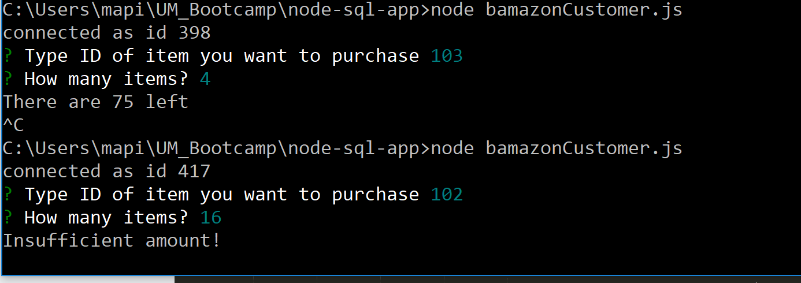

# BAmazon
An Amazon-like storefront using MySQL and Node.js
In this activity, you'll be creating an Amazon-like storefront with the MySQL skills you learned this week. The app will take in orders from customers and deplete stock from the store's inventory. 
## How this app works
1. A MySQL Database called `bamazon` holds my fictional store's inventory. This inventory is stored in a table titled `products`. The table contains Item ID, Product Name, Department, Price, and Quantity. If a person wants to purchase a product from my store, they have to remember the item_id for the product they want. There's a hidden field in the database that shows the last requested amount. 

2. Through NodeJS, a customer will run the program, `bamazonCustomer.js`, and will be presented with the store inventory.

3. The inquirer NPM package will initiate and will prompt the customer to insert the item_id of the product they would like to purchase and how much of that product.

4. If there is enough of that selected product in the store inventory, then the customer will be informed of the total price of their order. If the stock of that product is lower than the customer's requested amount, the program will inform the customer that there's insufficient quantity and will re-prompt to enter an item_id and requested amount.

5. The database will then be updated to reflect the remaining quantity of that item.